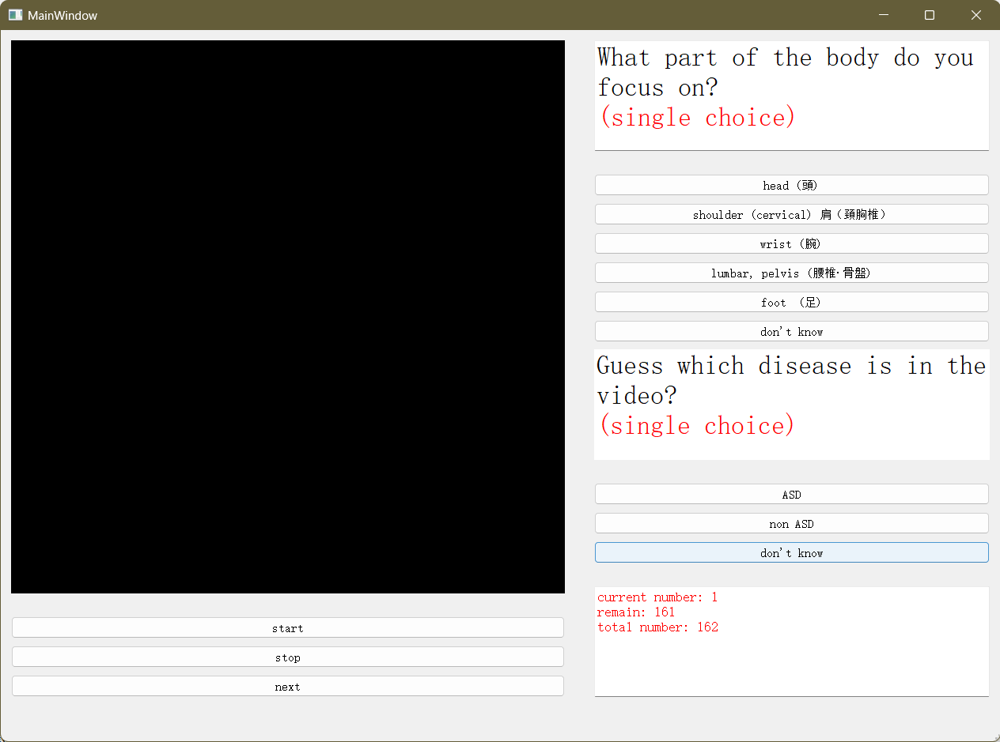

<div align="center">

# Interface for Adult Spinal Deformity

</div>

## Description  

📓 This project made with the PyQt5, PyInstaller, Python3.

This project make the interface for Adult Spinal Deformity (ASD), used for doctor to select the adult spinal predicted disease type and attention body part.

The attention body part include:

- head
- shoulder (cervical)
- wrist
- lumbar, pelvis
- foot
- don't konw

The disease type include:

- ASD
- non-ASD
- don't konw

Detailed comments are written for most of the functions and classes.
Have a happy code. 😄

## Folder structure

``` bash  
├─build
│   PyInstaller generate the sys file.
├─logs
|   Save the log file, include the doctor's selections.
├─imgs
|   imgs used by README.md.
├─misc
|   The additional video file decoder.
├─test_video
|   test video, for debug.
├─UI
│   UI file location, include the login.py and GUI.py
├─video
|   Video to experiment.
└─__pycache__
```

## How to run

1. This is login form, here you should input your name.

    

2. This is the main window, here you should select the predicted disease type and attnetion body part.

    The video is shown on the left and the options are on the right.
    Above on the right are the options for the attention part and below on the right are the options for disease prediction.

    

3. The final result will generated in [logs/](logs/), such as format: /logs/your_name_data.csv

## Installation  

In this application, we use the PyQt5.QtMultimedia.QMediaPlayer.
Because of this function can only decoder the .avi video file, but we have .mp4 video file.
So we need to install additional decoders, where locate in [LAVFilters](misc/LAVFilters-0.73.1.exe)

⚠️ Need first to install the additional decoder, otherwise an error will reported!

Make sure you install the PyQt5 and PyInstaller, or install them with pip.

``` bash
pip install PyQt5
pip install pyinstaller
```

## Invert .ui to .py

For PyQt5 import, you can invert the .ui file to the .py file.
Use pyuic to invert GUI.ui to GUI.py.
This will init include in PyQt5 lib.

``` bash
python -m PyQt5.uic.pyuic [GUI.ui] > [GUI.py]
```

## PyInstaller

In [build.py](build.py), can use PyInstaller to compile the .py file to .exe app.
For the final user.  

> ⚠️ Users should first check the **manual.docx** document to see how to use this application.
